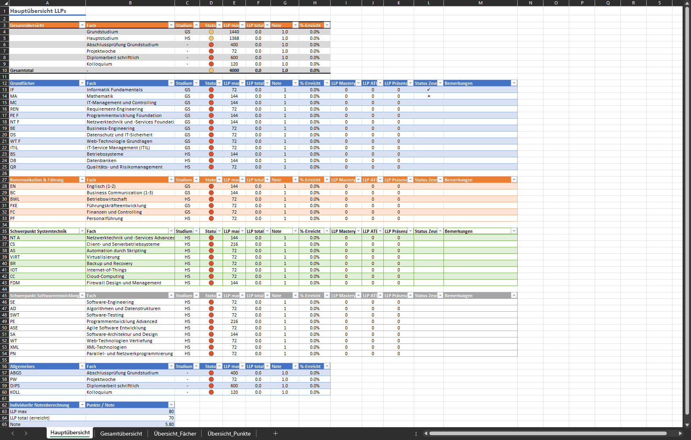
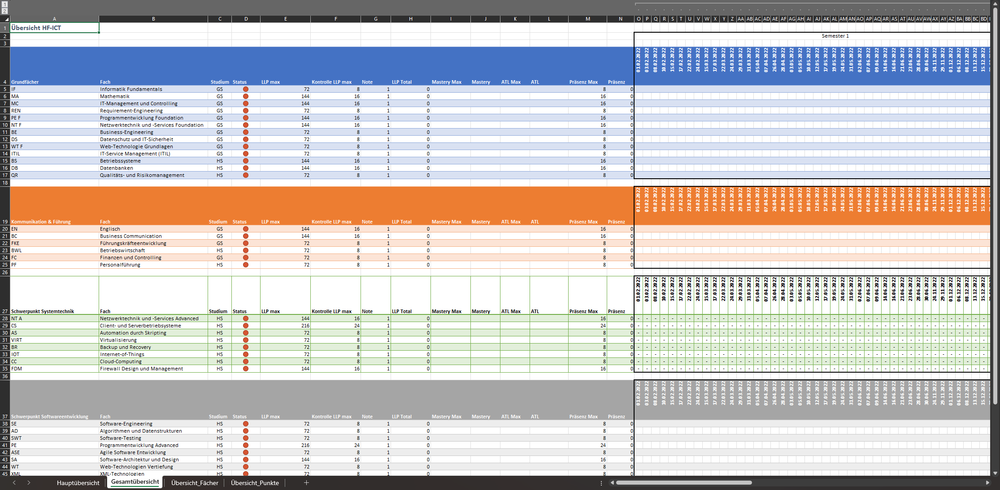

# Kontrolle der LLP

Die zur Verfügung gestellte Excel Datei dient als Kontrolle der LLPs.
Darin können sowohl die Anwesenheiten wie auch die MT und ATL Punkte notiert werden. Somit ist eine einfache Übersicht möglich.
Zudem können die LLP mit Zeus respektive SAL Schulnetz abgeglichen werden.

## Übersicht

Die Datei verfügt über mehrere Register. Die wichtigsten Register sind dabei die Hauptübersicht wie auch die Gesamtübersicht.
Die weiteren Registerkarten werden kaum benötigt und dienen unter anderem auch für die Datenhaltung.

### Hauptübersicht

Die Hauptübersicht soll eine schnelle Übersicht ermöglichen, wie der aktuelle Zustand ist. Ebenso kann hier eingetragen werden, ob die Punkteanzahl mit dem Zeus (oder SAL Schulnetz) übereinstimmt.
Zusätzlich besteht die Möglichkeit auch Bemerkungen dazu zu erfassen.

Die Hauptübersicht ist aufgeteilt in Gesamtübersicht, Grundfächer, Kommunikation & Führung, die beiden Schwepunkte sowie Allgemeines. Ebenso ist am Ende eine individuelle Notenberechnung enthalten, falls eine Note für eine ATL oder MT ausgerechnet werden soll.

In der Gesamtübersicht sind die einzelnen Abschnitte des Studiums aufgelistet. Für die einzelnen Abschnitte kann der Status definiert werden. Die LLPs werden zusammengerechnet aus den restlichen Abschnitten und müssen nicht eingetragen werden.

Bei den Grundfächer, Kommunikation & Führung, den Schwerpunkten und dem Allgemeinen muss nichts unternommen werden. Diese Daten kommen aus der Gesamtübersicht und werden hier zur besseren Übersicht dargestellt. Einzig die Spalten "Status Zeus" und "Bemerkungen" können hier ausgefüllt werden.

> [!IMPORTANT]  
> Die Schriftart in der Spalte Status SAL ist auf `Wingdings` eingestellt. Dies dient dazu das Häckchen oder x darzustellen.
> Für ein Häckchen muss ein `ü` geschrieben werden. Für ein x muss ein `û` geschrieben werden.

### Gesamtübersicht

Die Gesamtübersicht dient dazu die Daten respektive die LLP einzutragen.

Die Gesamtübersicht hat die gleiche Aufteilung wie die Hauptübersicht. 
Für jedes Fach kann in der Spalte Status, der Status des Faches ausgewählt werden.

Folgende Status stehen zur Verfügung:

- Offen
- in Bearbeitung
- Abgeschlossen

Jede Auswahl hat eine eigene Farbe. Offen wird in Rot, in Bearbeitung in Orange und Abgeschlossen in Grün dargestellt.
